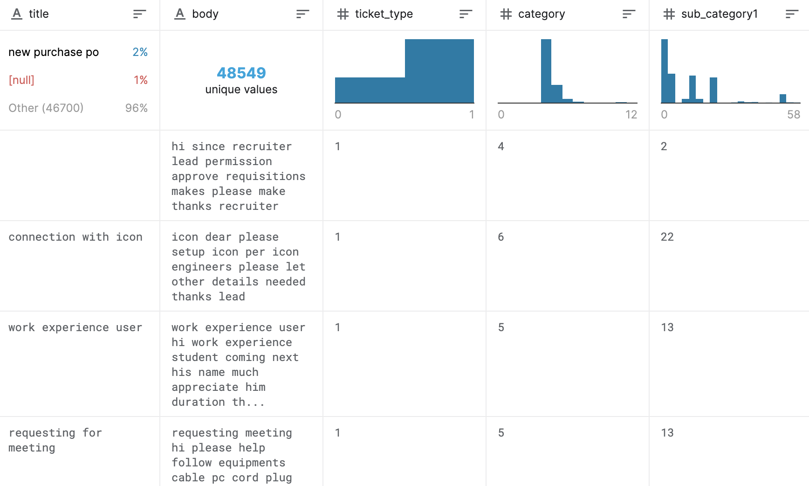
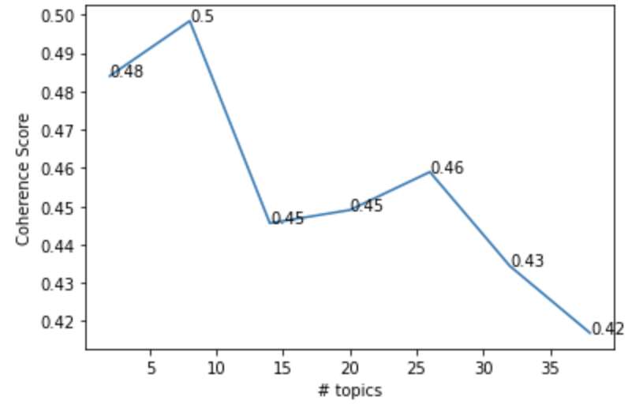
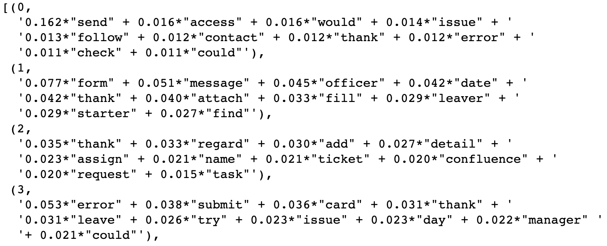
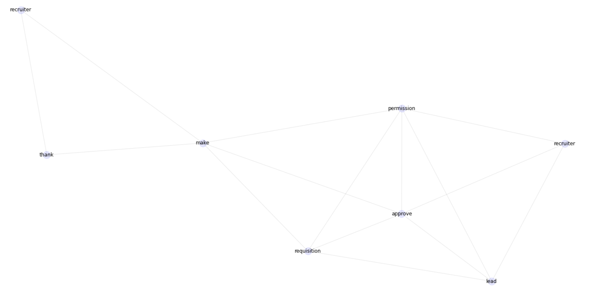

# Support Ticket NLP
Ticket Classification and Key Phrases Extraction

- Identify the main issues in the ticket description
- Extract the key phrases in the ticket description

----------------
#### Data
<a href="https://www.kaggle.com/aniketg11/supportticketsclassification">Support Ticket Classification</a>

----------------
#### Tasks
<ol>
  <li>Topic Modeling with LDA model
    <ol>
      <li>
      Preprocessing
        <ol>
          <li>Divide text to tokens</li>
          <li>Remove stopwords, punctuations</li>
          <li>Lemmatization</li>
        </ol>
      </li>
      <li>Compute coherence values to find the optimal number of topics</li>
      <li></li>
      <li>Build the LDA model</li>
      <li></li>
      <li>Utilize pyLDAvis to visualize the topics</li>
    </ol>
  </li>
  <li>Key Phrases Extraction with <a href="https://github.com/DerwenAI/pytextrank">pytextrank</a> (combining spaCy and networkx)
    <ol>
      <li>Construct a graph, sentence by sentence, based on the spaCy part-of-speech tags tags</li>
      <li>Use matplotlib to visualize the lemma graph</li>
      <li></li>
      <li>Use PageRank – which is approximately <a href="https://en.wikipedia.org/wiki/Eigenvector_centrality">eigenvalue centrality</a> – to calculate ranks for each of the nodes in the lemma graph
        <ol>
          <li>$a_{v,t}=1$ if vertex $v$ is linked to vertex $t$, and $a_{v,t}=0$ otherwise</li>
          <li>$M(v)$ is a set of the neighbors of $v$ and $\lambda$ is a constant</li>
        </ol>
      </li>
      <li></li>
      <li>Collect the top-ranked phrases from the lemma graph based on the noun chunks</li>
      <li>Find a minimum span for each phrase based on combinations of lemmas
        <pre><code>
        permission 1 0.17555037929471423
        requisitions 1 0.1742458175386728
        recruiter 1 0.1416381454134179
        </code></pre>
      </li>
    </ol>
  </li>
</ol>
  
----------------
#### Terminologies
<ul>
  <li>Topic Coherence</li>
  Scores a single topic by measuring the degree of semantic similarity between high scoring words in the topic
  <li>Latent Dirichlet Allocation (LDA)
    
  Given the # documents, # words, and # topics, output:
    <ul>
      <li>distribution of words for each topic K</li>
      <li>distribution of topics for each document i</li>
    </ul>
    
  </li>
</ul>
